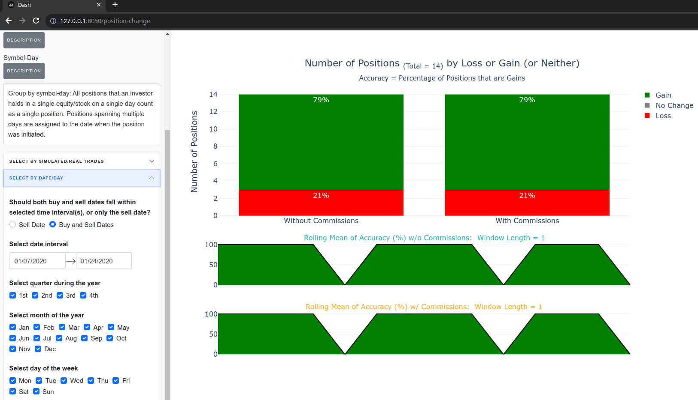
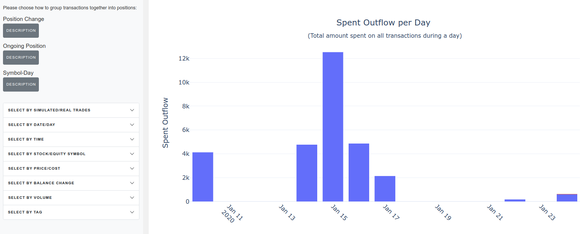

# Investment Trades Performance Metrics:  Plotly Dash Application

The code in this repository runs a [Plotly Dash](https://dash.plotly.com/) app that displays profit/loss and other metrics to track performance per transaction or over time.  The app also allows filtering of transactions by financial instrument type (i.e., stocks or options), long or short positions, bullish or bearish positions, transaction dates, instrument price, number of shares/contracts, custom user-provided tags, and other variables.

## Examples

A video showing some of the app's features can be seen [here](https://youtu.be/jej4qQ-lMu4) or [here](https://afairless.com/investment-performance-metrics-dashboard/).

Some screenshots from the app using fake example data are below:







## Run with Docker

From the top project directory, you can [run these commands](https://docs.docker.com/get-started/):

```code
sudo docker build -t docker-app .

sudo docker run -p 8050:8050 docker-app 
```

In the commands above, you may substitute a name of your own choosing for ```docker-app```.

Then point your web browser at:

http://127.0.0.1:8050/


## Run with Poetry

From the top-level directory, you can [run these commands](https://python-poetry.org/docs/basic-usage/):

```code
poetry install

poetry shell

python -m src.app.app
```

Then point your web browser at:

http://127.0.0.1:8050/
OR
http://0.0.0.0:8050/


## Run with Anaconda

From the top-level directory, you can [run these commands](https://docs.conda.io/projects/conda/en/latest/user-guide/tasks/manage-environments.html)

```code
conda env create -f environment.yml

conda activate dashboard_pipeline10

python -m src.app.app
```

Then point your web browser at:

http://127.0.0.1:8050/
OR
http://0.0.0.0:8050/


## Upload Data

Your own data can be uploaded to the app.  The uploaded [CSV](https://en.wikipedia.org/wiki/Csv_file) files must conform to the format and schema of the example file at ```example_data/output_data/filled_orders.csv```.  Full [Pandera](https://github.com/unionai-oss/pandera) schemas are in the ```src/schemas``` directory.


